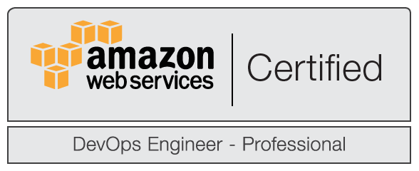
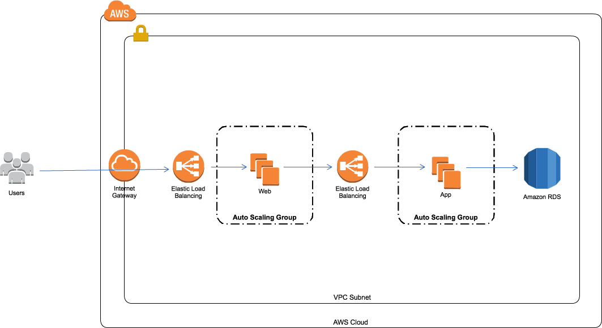
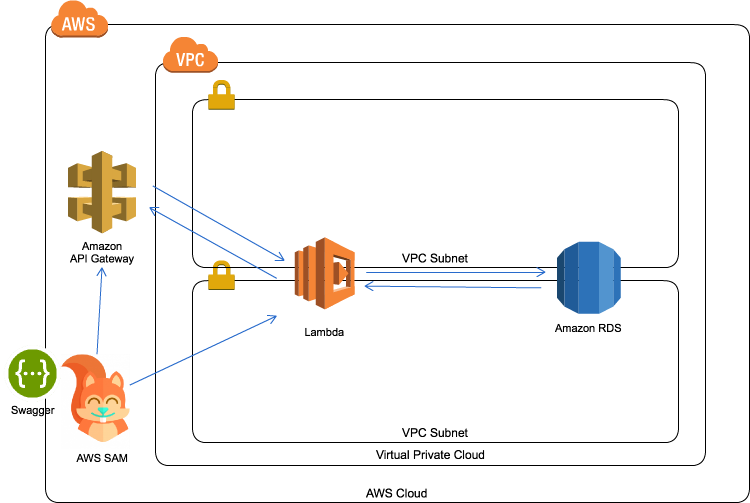
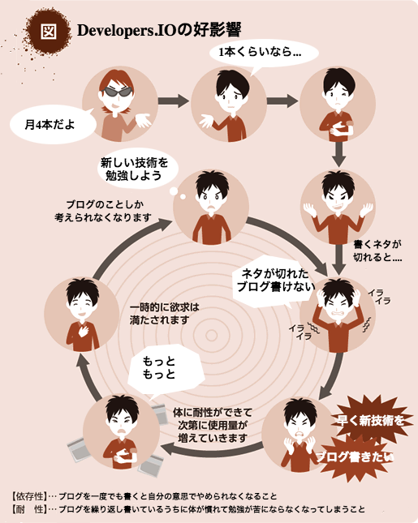

layout: true
class: center, middle

---
# 1年前はAWSと無縁だったエンジニアがクラスメソッドに入って~~身につけたこと~~成長できた理由
### クラスメソッド会社説明会@大阪 2017/02/27 中山 幸治

---
# 中山 幸治(knakayama)&nbsp;
### クラスメソッド AWS事業部 ソリューションアーキテクト
###  

---
layout: true
class: middle

---
### 1. このお話で伝えたいこと
### 2. 入社前の私
### 3. 今どういった業務を担当しているのか
### 4. なぜクラスメソッドに入ると成長できるのか
### 5. まとめ

---
layout: true
class: center, middle
---
# 1. このお話で伝えたいこと

---
background-image: url(images/recruit.png)
**エンジニアとして成長したかったらこんな話聞いてないで今すぐ応募しよう！！！！１１１１**

---
layout: true
class: center, middle

---
# 2. 入社前の私

---
# AWSを仕事で使ったことは 一度もない状態

---
layout: true
class: middle

---
### - 新卒で入った某ホスティング会社でレンタルサーバの運用と構築を3年
### - 自社データセンターを持っている会社だったので基本的にオンプレサーバと格闘
### - AWSを始めとするクラウドファーストな時代になるとオンプレの知識が一部の職人芸的なものになってくるのではという不安感(ちょっと言い過ぎかも)
### - エンジニアとしてこの業界で生き残るためには別のことを経験してみたかった

---
layout: true
class: center, middle

---
# 3. 今どういった業務を担当しているのか

---
# AWSを使ったシステムの 設計と構築

---
layout: true
class: middle

---
### - AWSを利用したクラウドネイティブなシステムを提案
### - 提案したシステムの構築も依頼された場合はそちらも担当
### - もちろん最適な構成を提案するにはそもそも何をAWSで作りたいのかヒアリングからスタートする必要がある
### - つまりお客様との折衝も担当

---
layout: true
class: center, middle

---
# 今担当している案件を 少しだけご紹介

---
### Auto Scaling Groupを利用した高可用なシステム

---
### AWS SAMとSwaggerを利用したデプロイフローの整備

---
layout: true
class: center, middle

---
# 4. なぜクラスメソッドに入ると成長できるのか

---
background-image: url(images/devio.png)
**Developers.IO**

---

---
layout: true
class: middle

---
### - 新しいことを学ぶ動機を作ってくれる
### - 論理的に文章を書く力 ≒ 人に自分の考えを伝える力が身につく
### - 100万PV/月のサイトで文章を書ける経験
### - 常に新しい技術を学ぶ必要のあるエンジニアにとってとても良い環境

---
layout: true
class: center, middle

---
# 5. まとめ

---
layout: true
class: middle

---
background-image: url(images/recruit.png)
**エンジニアとして成長したかったらこんな話聞いてないで今すぐ応募しよう！！！！１１１１**

---
layout: true
class: center, middle

---
# おわり
